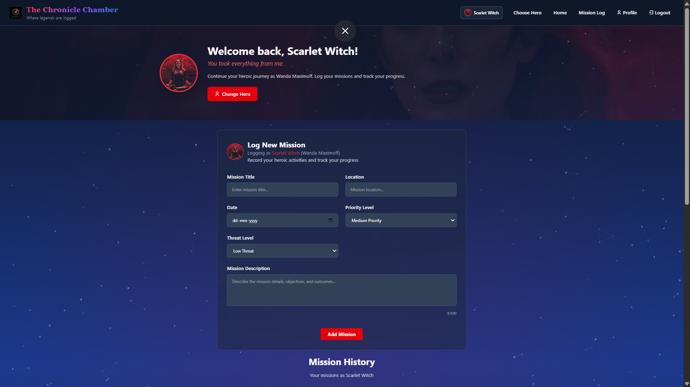

# The Chronicle Chamber ✨

[](https://github.com/Het1236/avengers-mission-log)
[](./LICENSE)
[](https://react.dev/)
[](https://firebase.google.com/)
[](https://tailwindcss.com/)
[](https://leafletjs.com/)

**Tagline:** Your personal nexus for heroic missions. Where every mission becomes history.

---

## 🚀 Live Demo

Experience "The Chronicle Chamber" in action!

[](https://avengers-mission-log.vercel.app/)

---

## 🎬 Introduction Video

Witness the immersive intro used on our authentication page, setting the stage for epic missions:

[](https://github.com/Het1236/avengers-mission-log/raw/main/src/assets/IntroVideo.mp4)

---

## 📖 Table of Contents

-   [1. Introduction](#1-introduction)
-   [2. Features](#2-features)
-   [3. Technologies Used](#3-technologies-used)
-   [4. Project Structure](#4-project-structure)
-   [5. Screenshots](#5-screenshots)
-   [6. Installation & Local Setup](#6-installation--local-setup)
-   [7. Firebase & Google Cloud Configuration](#7-firebase--google-cloud-configuration)
-   [8. Usage](#8-usage)
-   [9. Deployment](#9-deployment)
-   [10. Optimization & Performance](#10-optimization--performance)
-   [11. Future Enhancements](#11-future-enhancements)
-   [12. Acknowledgments](#12-acknowledgments)
-   [13. Contact](#13-contact)
-   [14. License](#14-license)

---

## 1. Introduction

"The Chronicle Chamber" is a modern, intuitive, and visually stunning mission logging web application designed as a submission for the LDCE Website Making Competition. Inspired by the dynamic world of the Marvel Cinematic Universe, this app allows users (Avengers) to meticulously log, track, and visualize their heroic missions. From secure authentication to interactive map displays and personalized hero profiles, "The Chronicle Chamber" serves as the ultimate digital archive for every heroic endeavor.

## 2. Features

"The Chronicle Chamber" offers a comprehensive set of features tailored for vigilant heroes:

* **🛡️ Secure Authentication:**
    * Seamless Sign-up and Login via Email & Password, Google, and Facebook.
    * Powered by Firebase Authentication for robust security.
* **🦸 Hero Selection:**
    * Choose your designated Avenger (Iron Man, Spider-Man, Doctor Strange, Thor, Wanda).
    * Hero information (name, image, etc.) fetched dynamically from Firestore Database.
* **📝 Mission Logging:**
    * Intuitive form to log new missions with fields: Title, Date, Description, Location, Priority, and Threat Level.
    * All missions are uniquely identified and linked to the user and selected hero in the database.
* **🃏 Interactive Mission Cards:**
    * Logged missions appear as visually engaging, flippable cards.
    * **Front:** Displays basic mission overview.
    * **Back:** Reveals detailed information with options to Edit or Delete the mission (fully database-integrated).
* **🗺️ Dynamic Mission Map:**
    * Displays location-specific pins for each logged mission.
    * **Interactive Zoom:** Clicking a pin triggers an Avenger-themed zoom animation, centering the map on the specific location (inspired by Google Maps functionality, with unique flair).
    * Map statistics (Total Missions, Active Missions, Priority breakdowns) attached below the map.
* **🗂️ Mission Log Page:**
    * Dedicated page to view all logged missions in detail.
    * **Hero Header:** Displays selected superhero image with a thematic quote.
    * **Comprehensive Filters:** Filter missions by various criteria (e.g., status, priority, hero).
    * **Integrated Calendar:** Left-sided calendar to track mission dates efficiently.
    * Includes the interactive mission map for contextual viewing.
* **👤 Personalized Profile Page:**
    * Showcases user profile photo and personalized information.
    * Sections for "Active Missions" (missions logged by the current hero) and "Active Heroes" (all heroes the user has selected across sessions).
* **🌟 Avenger Detail Pages:**
    * Clicking an Avenger card on the profile page redirects to a dedicated, animated detail page for that hero.
    * Features large hero image, iconic quotes, and detailed information (Name, Alias, Skills, Abilities, Weapons, etc.).
    * Designed for an immersive visual experience.
* **📱 Responsive Design:** Optimized for seamless viewing and interaction across various devices (desktop, tablet, mobile).

## 3. Technologies Used

"The Chronicle Chamber" is built using a robust and modern tech stack:

* **Frontend:**
    * [React](https://react.dev/) (v18+) - JavaScript library for building user interfaces.
    * [Vite](https://vitejs.dev/) - Next-generation frontend tooling for fast development.
    * [Tailwind CSS](https://tailwindcss.com/) - Utility-first CSS framework for rapid styling.
    * [React Leaflet](https://react-leaflet.js.org/) - React components for Leaflet maps.
    * [Leaflet.js](https://leafletjs.com/) - Open-source JavaScript library for mobile-friendly interactive maps.
    * [React-Geocode](https://www.npmjs.com/package/react-geocode) - React component for Google Geocoding API.
    * [React Spring](https://www.react-spring.dev/) - Physics-based animation library.
    * [Remixicon](https://remixicon.com/) - Open-source icon library for vector icons.
* **Backend & Database:**
    * [Firebase](https://firebase.google.com/) by Google
        * **Firebase Authentication:** For secure user login (Email/Password, Google, Facebook).
        * **Cloud Firestore:** NoSQL database for storing user data, missions, and hero information.
* **Deployment:**
    * [Vercel](https://vercel.com/) / [Netlify](https://www.netlify.com/) (or your chosen platform for continuous deployment).

## 4. Project Structure

The logical organization of the project files ensures modularity and maintainability:
```
avengers-mission-log/
├── public/                 # 🌐 Static assets (favicons, intro video, public SVGs for animations)
├── src/
│   ├── assets/             # 🖼️ Images, SVGs, etc. (bundled by Vite)
│   ├── components/         # 🧱 Reusable UI components (MissionCard, Navbar, MissionMap, etc.)
│   ├── config/             # ⚙️ Core configurations
│   │   └── firebase.js     # Firebase initialization and service setup
│   ├── context/            # 🤝 React Contexts (AuthContext, AvengerContext for global state)
│   ├── pages/              # 📄 Top-level page components (Auth, Home, Missions, Profile, etc.)
│   ├── services/           # 📞 Firebase service interactions (authService, firebaseService for API calls)
│   ├── utils/              # 💡 Helper functions and utilities
│   ├── App.jsx             # ⚛️ Main application component, routing logic
│   ├── index.css           # 🎨 Global styles (Tailwind base, components, utilities)
│   └── main.jsx            # 🚀 React app entry point (ReactDOM rendering)
├── .env                    # 🔑 Environment variables (e.g., VITE_Maps_API_KEY)
├── .gitignore              # 🚫 Files/folders to ignore in Git version control
├── package.json            # 📦 Project dependencies and NPM scripts
├── vite.config.js          # ⚡ Vite build configuration
└── README.md               # 📄 This README file
```
## 5. Screenshots

A visual tour of "The Chronicle Chamber":

### Authentication Page (with Animated Background)


### Hero Selection Page


### Home Page (Mission Logging & Map Overview)


### Missions Log Page (with Filters & Calendar)


### Profile Page


### Avenger Detail Page


## 6. Installation & Local Setup

Get "The Chronicle Chamber" running on your local machine with these simple steps:

1.  **Clone the Repository:**
    ```bash
    git clone https://github.com/Het1236/avengers-mission-log.git
    cd avengers-mission-log
    ```

2.  **Install Dependencies:**
    ```bash
    npm install
    ```
    *This command will install all necessary React, Leaflet, Firebase, and Tailwind CSS packages as defined in `package.json`.*

3.  **Environment Variables Setup:**
    * Create a `.env` file in the root of your project (same directory level as `package.json`).
    * Add your Google Maps API key (with Geocoding API enabled and *no* HTTP referer restrictions for local development) and your Firebase configuration details:
        ```env
        VITE_Maps_API_KEY=your_Maps_api_key_here
        VITE_FIREBASE_API_KEY=your_firebase_api_key
        VITE_FIREBASE_AUTH_DOMAIN=your_auth_domain
        VITE_FIREBASE_PROJECT_ID=your_project_id
        VITE_FIREBASE_STORAGE_BUCKET=your_storage_bucket
        VITE_FIREBASE_MESSAGING_SENDER_ID=your_Messaginger_id
        VITE_FIREBASE_APP_ID=your_app_id
        VITE_FIREBASE_MEASUREMENT_ID=your_measurement_id
        ```
    * **Important:** Replace `your_..._here` placeholders with your actual credentials from your Firebase project settings.

4.  **Run the Development Server:**
    ```bash
    npm run dev
    ```
    *The application will typically be available at `http://localhost:5173/`. Open your browser and navigate to this URL.*

## 7. Firebase & Google Cloud Configuration

To ensure full functionality of authentication, database, and mapping features, configure your Firebase and Google Cloud projects:

1.  **Firebase Project Setup:**
    * Create a new Firebase project in the [Firebase Console](https://console.firebase.google.com/).
    * Register your web app and copy your Firebase SDK config.
2.  **Firebase Authentication:**
    * Navigate to `Build > Authentication > Sign-in method`.
    * Enable **Email/Password**, **Google**, and **Facebook** providers.
    * For **Facebook Authentication:**
        * Go to [Facebook for Developers](https://developers.facebook.com/). Create a new "Consumer" app.
        * Under `Settings > Basic`, copy your **App ID** and **App Secret** and paste them into the respective fields in Firebase.
        * In Firebase, copy the **OAuth redirect URI** provided by the Facebook provider setup (e.g., `https://your-project-id.firebaseapp.com/__/auth/handler`).
        * Go back to your Facebook Developer App (`Products > Facebook Login > Settings`) and add this Firebase OAuth redirect URI to "Valid OAuth Redirect URIs".
        * Also, ensure your local development URL (`http://localhost:5173/`) is added as a "Valid OAuth Redirect URI" and a "Site URL" under the Facebook Login Web settings.
3.  **Cloud Firestore Database:**
    * Navigate to `Build > Firestore Database`.
    * Start a new database in your preferred region.
    * **Crucial:** Configure [Firestore Security Rules](#security-rules) to prevent unauthorized read/write access to your data.
    * Initialize your "heroes" collection with data for Iron Man, Spider-Man, Doctor Strange, Thor, and Wanda, or other default data your app relies on.
4.  **Google Maps Platform (Geocoding API):**
    * Go to [Google Cloud Console](https://console.cloud.google.com/).
    * Ensure the "Geocoding API" is **enabled** for your project (`APIs & Services > Library`).
    * Create an API key (`APIs & Services > Credentials`).
    * **API Key Restrictions:**
        * Under "API restrictions", select "Restrict key" and choose "Geocoding API" from the dropdown.
        * For **local development**, temporarily set "Application restrictions" to "None".
        * For **production deployment**, change "Application restrictions" to "HTTP referrers (web sites)" and add your deployed domain(s) (e.g., `https://your-domain.com/*`).

## 8. Usage

Navigate through "The Chronicle Chamber" and experience its features:

1.  **Authentication:** Upon launching the app, you'll be directed to the authentication page. Choose your preferred login method (Email/Password, Google, or Facebook).
2.  **Hero Selection:** After successful authentication, embrace your role by selecting your designated Avenger from the vibrant options.
3.  **Home / Mission Logging:** Proceed to the home page to begin your mission-logging journey. Utilize the intuitive form to record details like Title, Date, Description, Location, Priority, and Threat Level.
4.  **Interactive Map:** Explore the global landscape of missions on the integrated map. Click on individual mission pins to trigger dynamic Avenger-themed zoom animations, focusing on specific locations.
5.  **Mission Log:** Delve into a comprehensive record of all your logged missions on the dedicated Mission Log page. Utilize advanced filters to organize and quickly find specific missions, and reference the integrated calendar for chronological insights.
6.  **Profile:** Access your personalized profile page to view your profile photo, track your "Active Missions" (missions logged by your currently selected hero), and review "Active Heroes" (all the Avengers you've ever chosen).
7.  **Avenger Details:** Immerse yourself further into the Marvel universe by clicking on any Avenger card from your profile to reveal their dedicated, animated detail page, featuring their iconic information and lore.

## 9. Deployment

"The Chronicle Chamber" is designed for easy deployment to static hosting services. The recommended platforms include Vercel and Netlify due to their seamless integration with React/Vite projects and GitHub repositories.

1.  **Build for Production:**
    ```bash
    npm run build
    ```
    *This command will compile and optimize your React application, creating a `dist/` folder containing all static assets ready for deployment.*
2.  **Deploy to Your Chosen Platform:**
    * **Vercel / Netlify:** Link your GitHub repository to the platform. Ensure your environment variables (e.g., `VITE_FIREBASE_API_KEY`, `VITE_Maps_API_KEY`) are correctly set up in the platform's dashboard under "Environment Variables".
    * **Firebase Hosting:** If utilizing Firebase Hosting, you can deploy using the Firebase CLI after building your project.

## 10. Optimization & Performance

We've meticulously optimized "The Chronicle Chamber" to deliver a fluid and performant user experience:

* **🎬 High-Quality Video Background:** The introductory video on the authentication page is carefully optimized (compressed MP4/WebM, suitable resolution, seamless loop) to provide an immersive visual without compromising page load times.
* **🖼️ Image Optimization:** All static images (hero photos, profile pictures, mission card elements) are compressed and served in modern, efficient formats (e.g., WebP, JPEG) to reduce asset loading.
* **⚡ Vite Build Pipeline:** Leveraging Vite's lightning-fast development server and highly optimized Rollup-based production build process, ensuring automatic minification, tree-shaking (eliminating unused code), and efficient code splitting for smaller bundle sizes.
* **🧩 Component Lazy Loading:** Key components that are not critical for the initial page render are dynamically imported using `React.lazy()` and `Suspense`, improving the app's perceived load speed.
* **🔥 Firebase Data Management:** Efficient and secure data fetching from Cloud Firestore, with real-time listeners implemented judiciously to manage network requests and resource usage.
* **📍 Geocoding Efficiency:** Geocoded coordinates for mission locations are cached in the local React state (`coordinates` state), significantly minimizing redundant API calls to the Google Geocoding service for repeated locations.
* **🎨 Tailwind CSS:** Utility-first approach ensures only necessary CSS is bundled, reducing stylesheet size and improving render performance.

## 11. Future Enhancements

The "Chronicle Chamber" is poised for continuous expansion:

* **🧑‍💻 User Roles & Admin Dashboard:** Implement different user roles (e.g., standard Avenger, S.H.I.E.L.D. director) with a dedicated admin dashboard for comprehensive mission and hero management.
* **🤝 Mission Collaboration & Sharing:** Enable users to collaborate on missions or share their heroic logs with other authorized users.
* **🔔 In-App Notifications:** Implement real-time notifications for upcoming mission dates, critical threat level changes, or important updates.
* **🥋 Advanced Avenger Customization:** Allow users to unlock and apply different suits, abilities, or aesthetic customizations to their selected Avengers.
* **💬 Integrated Communication:** Add an in-app chat system or comment sections for mission coordination and debriefs.
* **🗺️ Enhanced Map Features:** Explore custom Leaflet tile layers, display heatmaps of mission density in specific regions, or integrate real-time weather effects for mission locations.

## 12. Acknowledgments

A special thanks to the following for their invaluable contributions and resources:

* **LDCE**: For providing the platform and opportunity through the Website Making Competition.
* **Firebase**: For a robust and scalable backend-as-a-service solution.
* **The React, Vite, and Tailwind CSS Communities**: For their exceptional tools and continuous innovation.
* **Leaflet.js & React Leaflet**: For empowering the interactive map features.
* **Remixicon**: For the versatile and stylish icon set.
* **RunwayML**: For bringing the epic intro video to life.
* **My mentors and teammates**: For their guidance, support, and collaborative spirit throughout the development process.

## 13. Contact

For any questions, feedback, or collaborations, feel free to reach out:

* **Your Name:** Het Patel
* **Email:** 1236hetpatel@gmail.com
* **GitHub:** https://github.com/Het1236
* **LinkedIn:** www.linkedin.com/in/het-patel-0138a21b8

## 14. License

This project is open-source and licensed under the [MIT License](https://opensource.org/licenses/MIT). You are free to use, modify, and distribute this software, provided the original copyright and license notice are included.

---